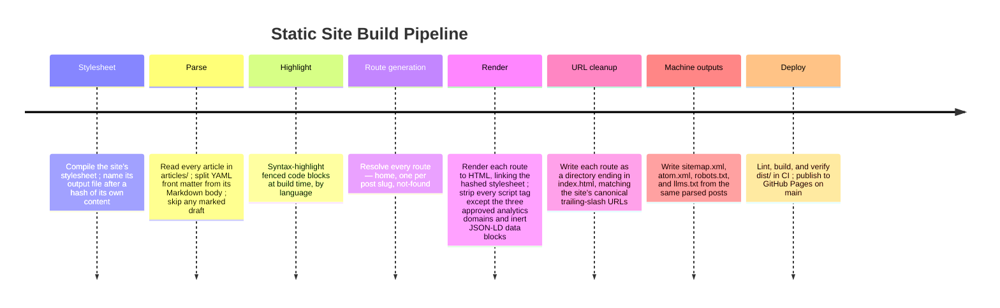

# Site Architecture

A from-scratch, Leptos-templated static site generator turns Markdown blog posts into a small set of static HTML pages, deployed to GitHub Pages with no client-side JavaScript beyond three named analytics scripts.

## What a reader can do

- Land on the home page and read a short author bio, with a link to the author's LinkedIn profile.
- Browse the list of blog posts, newest first, each showing its title, publish date, and — when the post has one — a short description.
- Open any post and read it in full, including syntax-highlighted code samples.
- See a properly formatted preview (title, description, image) when a post's link is shared on social media or messaging apps.
- Land on a dedicated "page not found" page, with a link back home, if a URL doesn't match the home page or any post.
- Reach every page at a clean, human-readable, trailing-slash URL, with no redirects.
- Subscribe to new posts in a feed reader via the site's Atom feed.
- Find the site and its posts through search engines, which get a sitemap, per-page descriptions, canonical URLs, and structured data to index from (see `docs/seo.md`).

## Routes

| Page | URL shape | Output file |
|---|---|---|
| Home | `/` | `dist/index.html` |
| Post | `/post/<slug>/` | `dist/post/<slug>/index.html` |
| Not found | (fallback) | `dist/404.html` |

Alongside the pages, the build writes four machine-readable files to `dist/`'s top level — `sitemap.xml`, `atom.xml`, `robots.txt`, and `llms.txt` — generated from the same parsed posts the pages render from, so they can never drift from the routes that exist. `docs/seo.md` describes them.

Every post's slug is its source filename's stem in `articles/`; the set of post routes is generated by enumerating every article at build time. An article whose front matter sets `draft: true` is left out of that enumeration entirely — it gets no route, no output file, and no home page listing.

## Build pipeline

The stylesheet is compiled first, before any page renders, and its output filename carries a hash of its own content (e.g. a page links a stylesheet named after that hash rather than a fixed name). That way, editing the stylesheet always produces a new URL, so a visitor's browser can cache it indefinitely without ever serving a stale, edited-but-not-yet-fetched copy.

Markdown parsing and front matter follow CommonMark only — tables, strikethrough, and smart punctuation are deliberately disabled so that straight quotes in source posts are never rewritten to curly ones. Fenced code blocks are pulled out of the Markdown parse, syntax-highlighted by language, and re-inserted as highlighted HTML before the rest of the page is rendered.

Rendering strips every `<script>` tag from the generated HTML except the three that load the site's approved analytics providers (Tiny Analytics, Simple Analytics, Plausible) — this also removes Leptos's own hydration bookkeeping script, since the site is server-rendered only and never hydrates in the browser. The one other script form that survives is the JSON-LD structured-data block on each post page: inert JSON a search engine reads, never code the browser runs.

URL cleanup normalizes the generator's output to the site's canonical URL shape: every route resolves to a directory ending in `index.html` rather than a bare `.html` file, so links match the trailing-slash form the site's own route helpers produce, and the static host serves each page directly with no redirect.

Deploy runs in GitHub Actions on every push and pull request: lint the code, build the site, independently re-verify that `dist/` contains no WebAssembly reference and no script tag outside the three approved analytics domains and the JSON-LD data-block form, and confirm the required output files (including the sitemap, feed, and robots file) are present. On `main` only, the workflow publishes `dist/` to GitHub Pages at the custom domain.
